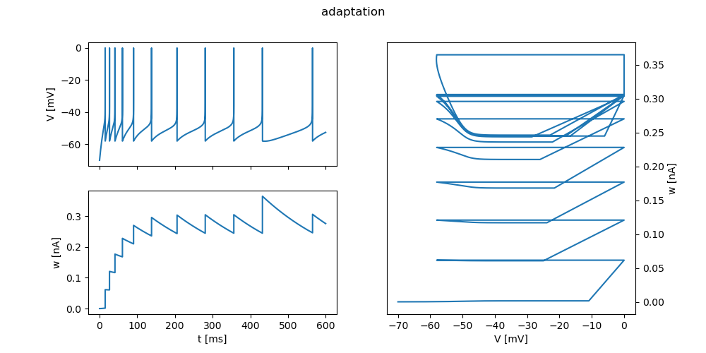

# AdEx

[](https://github.com/tetzlab/FIPPA/actions/workflows/AdEx.yml)

```shell
make
```



# Requirements

* [Arbor](https://github.com/arbor-sim/arbor) >= 0.6
* [matplotlib](https://matplotlib.org) >= 3.4.1
