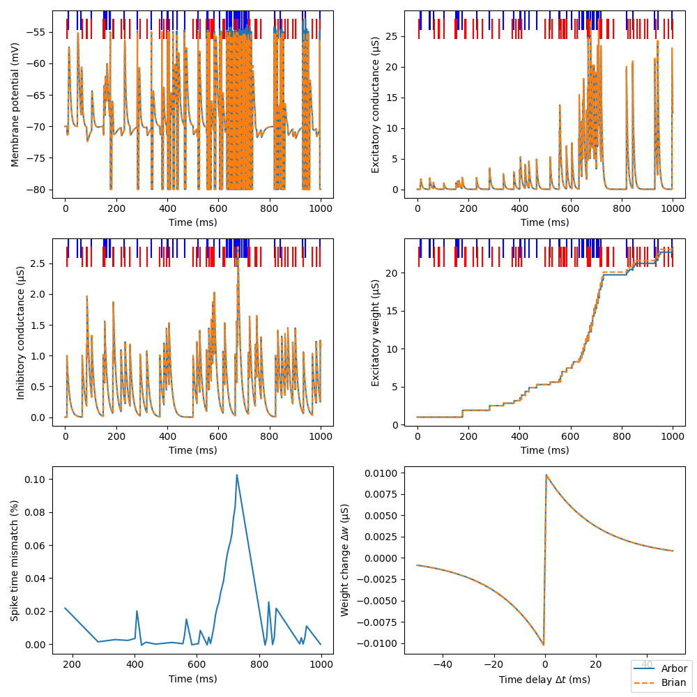

# Spike-driven plasticity

[](https://github.com/tetzlab/FIPPA/actions/workflows/STDP.yml)

A synapse with spike-timing-dependent plasticity (STDP) has been added to Arbor.

The implementation is validated against the Brian 2 and the NEST simulator.

# How to

First, install Arbor. If you install from source, make sure `arbor-build-catalogue` from the Arbor
scripts directory is in `PATH`, or modify the `Makefile` accordingly.

Next, if necessary, adapt `run_arbor.sh` and `run_brian2.sh` to your environment.

Parameters for the provided simulations ("LIF" and "classical") can be changed in `config_lif,json` or `config_classical.json`.

Then, use the `make` calls below for the comparison between Arbor and Brian 2 or NEST:

```shell
make make comparison_brian2_arbor.png
make make comparison_nest_arbor.png
```

Or simply call

```shell
make
```
for the default configuration (Arbor and Brian 2).




# Requirements

* [Brian2](https://briansimulator.org) >= 2.4.2
* [NEST](https://www.nest-simulator.org/) >= 3.8.0
* [Arbor](https://github.com/arbor-sim/arbor) >= 0.9.0
* [matplotlib](https://matplotlib.org) >= 3.4.1
* [scipy](https://scipy.org/) >= 1.11.4
* [scikit-learn](https://scikit-learn.org) >= 1.5.0
