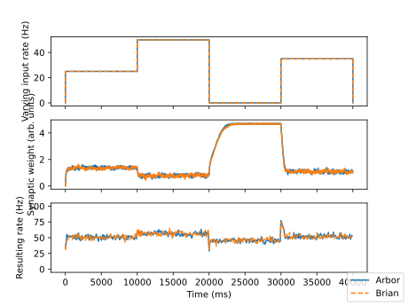
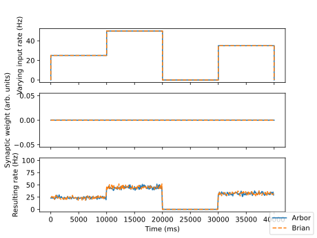

# Spike-based homeostasis

[](https://github.com/tetzlab/FIPPA/actions/workflows/homeostasis.yml)

With input from FIPPA, Arbor was extended with the possibility for event-driven plasticity. This allows for spike-based homeostasis.
Following the approach in O. Breitwieser's thesis "Towards a
Neuromorphic Implementation of Spike-Based Expectation Maximization",
two poisson stimuli are connected to a neuron. One with a varying rate
and the other with a fixed rate.  The synaptic weight from the varying
rate stimulus to the neuron is fixed. The synaptic weight from the
fixed rate stimulus to the neuron is plastic and tries to keep the
neuron at a firing rate that is determined by the parameters of the
plasticity rule.

The implementation is validated against the Brian 2 simulator (also see [here](https://brian2.readthedocs.io/en/stable/examples/synapses.spike_based_homeostasis.html)).

# How to

First, install Arbor. If you install from source, make sure `arbor-build-catalogue` from the Arbor
scripts directory is in `PATH`, or modify the `Makefile` accordingly.

Next, if necessary, adapt `run_arbor.sh` and `run_brian2.sh` according to your environment.

Parameters can be changed in `config.json` or copied to a new configuration
file, e.g., `config_modified.json`.

Then, simply call

```shell
make
```
to obtain the following plots:

Target case with plasticity:


Control case without plasticity:



You may also call

```shell
make CASE=target
```
or

```shell
make CASE=control
```
to run the two cases separately.

# Requirements

* [Brian2](https://briansimulator.org) >= 2.4.2
* [Arbor](https://github.com/arbor-sim/arbor) == 0.10.0
* [matplotlib](https://matplotlib.org) >= 3.4.1
* [scikit-learn](https://scikit-learn.org) >= 1.5.0
